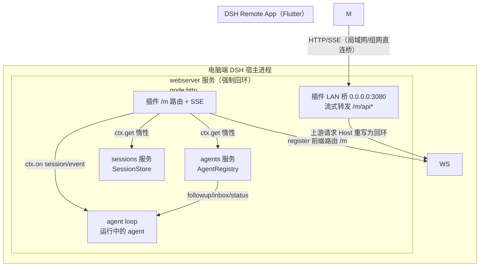
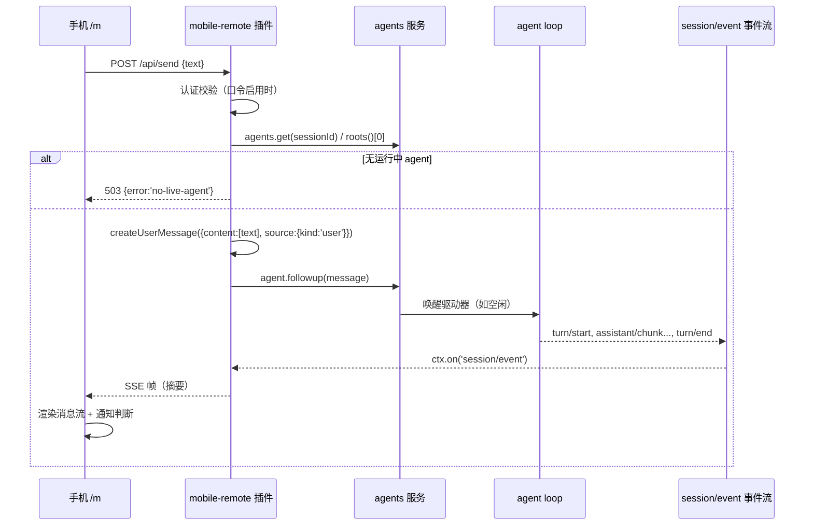
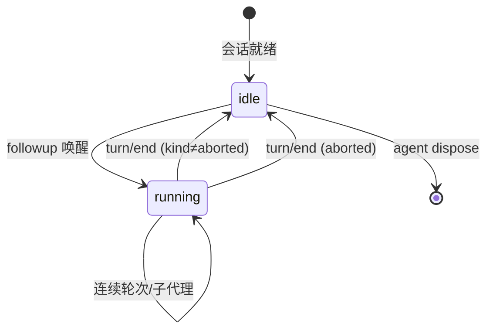
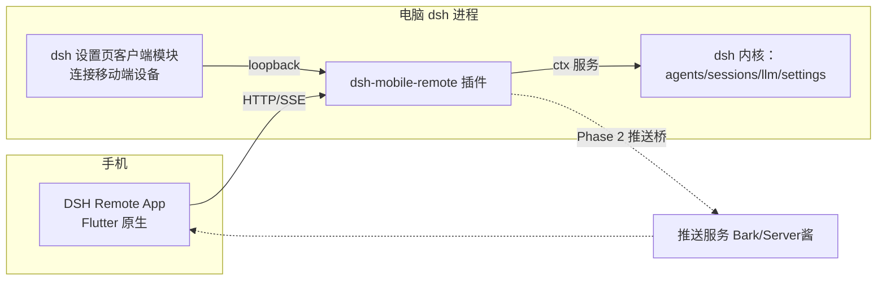
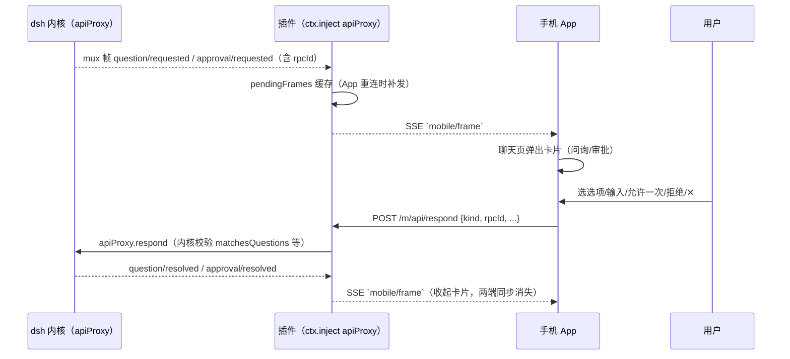
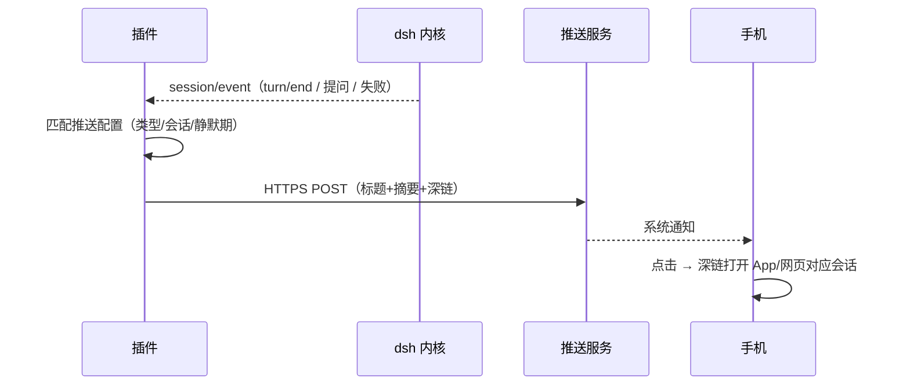

# 02 系统架构设计说明书 — dsh-mobile-remote

> 版本：v3.0.0 · 状态：已实现（v2.3 问询/审批弹窗桥、v2.4~v2.5 连接自愈、v2.6 安全加固+模型提供商互通、v2.9/v3.0 LAN 桥 + 图像链路） · 配套：01-PRD.md、03-api.md、04-security.md、09-compatibility.md

## 1. 背景与范围
DSH 由 Cordis 组合出宿主（desktop 版 `dsh-plugin-desktop` 或 web 版 `dsh --profile web`），webserver 默认只绑定 `127.0.0.1`（**桌面版 0.1.1-rc.2 起强制回环**，DesktopsWebServer 对非回环 host 直接 throw）。本插件在宿主侧挂载 Cordis 插件：在 webServer 上注册 `/m` 前缀路由，并在 **LAN 桥**（`lanBridge`，默认 `0.0.0.0:3080`）自建监听把移动端请求流式转发到回环 webserver——移动端形态为**原生 Flutter App**（`dsh-mobile-app`），经 `/m/api` 与插件通信。插件不修改桌面 GUI 的任何现有 UI。
## 2. 技术选型结论与理由
### 2.1 移动端形态：独立轻量页（`/m`） vs 桌面 GUI 窄屏适配

| 方案 | 优点 | 缺点 | 结论 |
|---|---|---|---|
| 桌面 GUI 窄屏适配（client 插件 + slot） | 复用现有 React 组件、自动获得全部功能 | 三栏 AppFrame 适配工作量大；HMR 依赖 `pnpm run dev:web` watcher；触控体验难做通 | 放弃 |
| **独立轻量页 `/m`（本方案）** | ~500 行原生 HTML/CSS/JS 覆盖全部需求；无构建；与桌面 UI 零耦合；可独立控制安全边界 | 功能需自己实现（消息流、通知、历史） | **采用** |

### 2.2 外出通路：蒲公英（虚拟组网） vs 隧道/反代 vs 裸公网
| 方案 | 认证/TLS | 成本 | 结论 |
|---|---|---|---|
| **蒲公英/虚拟组网（WireGuard 组网）** | 设备身份认证 + 端到端加密，零应用层代码 | 免费版 3 成员 | **采用**（实测通过；账号可用性属个体情况，其他组网如 ZeroTier/EasyTier 同理可接） |
| 隧道/中继类（frp/SakuraFrp，`trustedHosts`） | 需自建认证 + **必须 TLS**（自有域名须 ICP 备案） | 免费/收费 | 备选（有合规门槛） |
| cloudflared 隧道 | TLS 自动，但公网可达需自建认证 | 免费，需额外 token 机制 | 备选 |
| 裸公网暴露 0.0.0.0 | 无 TLS | 高危（agent 可执行 bash/pwsh ≥ RCE） | 明确禁止 |

### 2.3 前端技术：原生 JS vs 框架

单页无构建、无路由、无状态管理需求 → 原生 HTML/CSS/JS（ES2022），`EventSource` 接 SSE、`fetch` 接 JSON API、`Notification` 做提醒。避免引入 Node 侧构建链。
### 2.4 二维码生成：npm `qrcode` 包（Node 侧）

Node 侧直接生成 PNG data 输出到 ``，前端零依赖；避免在前端内联 QR 编码算法（Reed-Solomon 实现量大）。
### 2.5 其余依赖

- `@deepseek-ai/schemastery`（Config schema，与 dsh 同款）
- `@deepseek-ai/dsh-llm`（`createUserMessage` 构造消息）
- 宿主机服务：`webServer`（路由）、`agents`（AgentRegistry，惰态 `ctx.get`）、`sessions`（SessionStore，惰态 `ctx.get`）
## 3. 架构分层

- **插件层**（本插件）：路由注册、LAN 桥转发、JSON API、SSE 事件桥、认证、二维码、推送桥。
- **服务层**（dsh 现有）：`agents`（注入消息、查状态）、`sessions`（列会话、读事件历史）、`webServer`（传输）。
- **执行层**：agent loop 消费 inbox 消息，产出 `session/event` 事实流。
## 4. 模块划分

### 4.1 服务端（`lib/index.js`）
| 模块 | 职责 |
|---|---|
| 路由注册 | `webServer.register`：前缀 `/m/api/*`、`/m/qr.png`；dispose 时全部注销 |
| JSON API | bootstrap / send / sessions / history / catalog / notifications / defaults …（见 03-api.md） |
| SSE 事件桥 | `ctx.on('session/event', ...)` → 摘要化 → 广播到移动端连接；心跳注释帧；连接数上限 |
| 认证 | 口令比对（常量时间，`X-Mobile-Token` 头）→ 401 语义 |
| 二维码 | `qrcode` 生成 PNG（桌面设置页扫码用） |
| 地址发现 | `os.networkInterfaces()` 枚举 IPv4（含虚拟组网段，过滤 VMware 等虚拟网卡），port 取自 `lanBridge.port`（桥监听成功时）否则 `ctx.webServer.port` |

### 4.2 客户端（`dsh-mobile-app` Flutter + `lib/client.js` 桌面模块）
| 模块 | 职责 |
|---|---|
| App 状态层（`store.dart`） | bootstrap 缓存、当前会话、SSE 重连（指数退避）、事件去重（messageId/seq） |
| App 消息流（`chat_screen.dart`） | user/assistant 气泡、流式合并（节流）、Markdown 渲染、活动条（思考/工具过程，v2.6）、轮次分隔 |
| App 通知页 | turn/end 分类通知（完成/失败/需回答）、已读持久化、未读角标 |
| App 会话/新建 | 会话列表、新建会话（模式 + 目录跨盘浏览） |
| App 设置 | 余额、默认预设、深色模式、诊断、重新配置 |
| 桌面客户端模块（`client.js`） | dsh 设置页「连接移动端设备」：拉取 `/m/api/qr-config` 展示二维码 |

## 5. 核心时序

### 5.1 发消息全链路

### 5.2 事件摘要规则（服务端，防止移动端流量膨胀）
| 事件类型 | 下发给移动端的载荷 |
|---|---|
| `user/message` | 全部 text blocks（≤2000 字符） |
| `assistant/message` | 全部 text blocks（≤20000 字符），reasoning 折叠计数 |
| `assistant/chunk` | 仅 text delta（≤4000 字符缓冲合并） |
| `tool/result` | 工具名 + 成功/失败 + 截断内容（≤2000 字符） |
| `turn/start` / `turn/end` | 类型 + 轮次数 / 结束原因 |
| 其他 | 仅类型名（可忽略事件不推送） |

## 6. 状态机

- 移动页顶部状态点直接来自最近的 `turn/start`/`turn/end` 事件推断；`bootstrap`/`agents` 接口提供权威值。
- "完成通知"触发条件：`running → idle` 且页面文档处于 hidden 状态。
## 7. 关键设计决策（ADR 简表）

| # | 决策 | 理由 |
|---|---|---|
| D1 | **桌面版：LAN 桥转发（回环 webserver 不动）；web 版：profile patch 绑定 0.0.0.0** | 桌面版 0.1.1-rc.2 强制 webserver 回环（patch 覆盖 host 会 throw），只能在插件内自建监听转发；web 版无此限制，patch 覆盖须写全必填字段（见 06 §4） |
| D2 | 口令认证默认关闭 | 信任网络层（自家 WiFi + 虚拟组网）；口令是可选加固而非默认摩擦 |
| D3 | SSE 而非轮询 | 现有 `/plugins/events` 同款模式；事件延迟 <500ms 需求 |
| D4 | 移动页不发起新会话 | 会话创建/模型配置语义复杂（preset、模型选择），v1 只续接 |
| D5 | 摘要下放而非全量事件 | 控制流量与渲染成本；桌面 GUI 全量能力不受影响 |

## 8. 非功能架构
- **连接管理**：SSE 连接 Set，上限 16；dispose 时 `res.destroy()` 全部连接。
- **心跳**：每 25s 发送 `: ping` 注释帧，防中间代理断连。
- **事件广播失败隔离**：单个连接写入抛错 → 只断开该连接，不影响其他订阅者。
- **无状态**：插件无自有持久化；重启 dsh 后插件随组合树重新挂载，SSE 连接由客户端重连恢复。
## 9. 风险与应对
| 风险 | 影响 | 应对 |
|---|---|---|
| 0.0.0.0 暴露给陌生网络 | 他人可驱动 agent | 04-security.md：口令加固 + 使用场景约束（仅可信 WiFi/虚拟组网） |
| 浏览器通知被系统拦截 | 收不到完成提醒 | 页面内横幅降级 + 用户手册说明系统设置 |
| dsh 服务名变动（agents/sessions 接口演进） | 插件失效 | 惰态 `ctx.get` + 明确错误文案；依赖固定 rc.6 版本 |
| SSE 在移动网络下断连 | 消息流中断 | 指数退避重连 + 重连后历史增量补齐 |

---

# 第二部分：移动端产品版架构（v2.1，配套 00-开发总纲）
## 10. 总体形态

- **单一 API 面**：App 共用 `/m/api/*`；API 先行，两端后写（总纲 §5）
- **App = 原生实现**：Flutter 全部界面（Phase 3 完成，v2.1 起唯一移动端形态）
- **网页版已移除**：v2.1 起不再提供 `/m` 页面（`page.html` 删除），减少运行资源；桌面设置页由客户端模块提供

## 11. 新增服务与模块（插件侧）

| 模块 | 职责 | 依赖 |
|---|---|---|
| `catalog` | 模型/推理/权限/预设枚举聚合（读 PC 端真实目录） | `ctx.llm`、permission-presets、agent-presets manifest |
| `session-config` | 当前会话模型/推理/权限读写（写走 PC 端同一事件路径） | `agents`、permission 服务 |
| `session-create` | 按 preset 新建会话并覆写配置 | `agents.create`、presets |
| `notifications` | 事件流聚合（completed/needs-answer/failed） 已读状态（文件持久化 `~/.dsh/mobile-remote/read-notifs.json`） | `ctx.on session/event` |
| `mobile-actions` | 动作注册表服务 `ctx.mobileActions` + 清单/执行端点 | 注册表（Cordis 语义） |
| `respond` | 问询/审批应答（v2.3）：经 `apiProxy.respond` 回写，与 PC 端 GUI 同一 pending 通道 | `apiProxy`（`ctx.inject`） |

## 12. 关键实现要点

- **通知聚合**：`turn/end` 的 reason.kind 分类（completed/failed/blocked=needs-answer）；聚合为内存记录 + 已读集合文件持久化（不再用 settings 域——无 fiber 的 HTTP 回调里调 settings 会崩进程）
- **权限写入**：`POST /api/session-config` 的权限项复用 PC 端 `/permission <preset>` 的写入路径（permission/preset 事件 + sandbox/approval 旋钮），确保桌面 GUI 与移动端看到同一事实
- **模型切换**：经 `ctx.agents` 的 per-session LLM target 设置（`installAgentLlmTarget` 语义），与 GUI 模型选择器一致
- **动作执行**：handler 在电脑端运行，长任务结果经会话事件回流（不阻塞 HTTP 响应）

## 12b. 问询/审批弹窗桥（v2.3，与 PC 端同一 pending）

- **获取服务必须用 `ctx.inject(["apiProxy"])`**：各插件上下文隔离，`ctx.get` 看不到兄弟插件注册的服务（dsh-client-connection 同款用法）。
- 只转发 question/approval/session-queue 瞬态帧；`session/event` 仍走 `ctx.on` 桥避免重复。
- **私有协议风险**：`events.mux` / `respond` 消息格式无稳定版本承诺；缺失时干净降级（`/m/api/respond` 返回 503、诊断 `respondBridge=false`），详见 docs/09-compatibility.md。
- 断线补发：App 重连 SSE 时插件回放 `pendingFrames`；从「需要你回答」通知进入会话即见挂起弹窗。
- 另一端先答：内核 pending 表先到先得，后答方收到 `not-pending`，App 收起卡片并提示"可能电脑端已先回答"。
## 13. 推送桥（Phase 2 架构）

- 配置：`settings` 域（推送服务 URL、密钥、事件类型开关、静默时段）
- 深链：点击系统通知 → 打开 App 通知中心/对应会话（当前实现：通知中心条目跳转；App 自定义 scheme 深链未做）
- 去重/节流：同会话同类型 60s 内合并
## 14. App 架构（Phase 3 要点）
- Flutter 单工程；状态管理 ChangeNotifier（`store.dart` 的 `AppStore`）；SSE 用 `http` 包流式解析
- 页面：首页（欢迎 + 最近会话） 会话 / 对话 / 通知 / 设置（对照原型 v7）
- 本地存储：连接配置（地址/口令）、UI 偏好（工具显示、主题、工作区选择）
- 连接自愈（v2.4.1~v2.5.1）：bootstrap `server.urls` 收集全部地址（局域网 + 蒲公英/虚拟组网，排除 169.254/16 链路本地与 VMware 虚拟网卡）；SSE 心跳看门狗（45s 无心跳强制重建）+ 超时即轮换（黑洞地址约 10s 故障切换）；下拉刷新「探测 → 自愈 → 拉数据」；SSE 周期断连经实测系手机息屏 Doze（屏亮自动重连+唤醒重同步，非缺陷）
- 通知：App 内通知中心实时角标（SSE 推送）；后台系统级提醒依赖 Phase 2 推送桥（App 不保活长连接）
