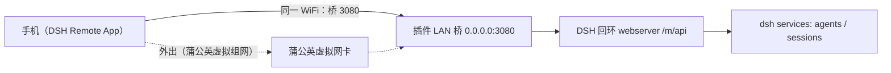

# 06 部署与启用文档 — dsh-mobile-remote

> 版本：v3.0.0 · 状态：已在本机安装与验证 · 配套：03-api.md、04-security.md、07-user-manual.md、09-compatibility.md
> 适用环境：**DSH 0.1.1-rc.2（DSH Desktop v2.0.2）**。桌面版 webserver 强制只听 `127.0.0.1`，移动端经插件 **LAN 桥**（默认 `0.0.0.0:3080`）接入；web 版 DSH 无回环限制，可直接让 webserver 绑 0.0.0.0。

## 1. 部署拓扑



- 手机端：安装 DSH Remote App（构建方法见 §8），连接电脑地址（如 `http://192.168.1.100:3080/m` 或 `https://<蒲公英虚拟IP>:3080/m`——**端口 3080 是插件桥端口**，见 §4b）。
- 桌面端入口：DSH Desktop 设置页「连接移动端设备」（插件客户端模块）显示二维码与连接信息（二维码在桥监听成功时自动使用桥地址）。
- 外出访问：**蒲公英组网**（推荐，见 §5.1）；其他虚拟组网/隧道类见 §5.2。

### 1.1 两种运行形态速查（先看你是哪种）

| 形态 | webserver host | 手机连接方式 | 插件额外配置 |
|---|---|---|---|
| **web 版**（`dsh --profile web`）| 默认 `0.0.0.0:3080` | **开箱直连** `http://<IP>:3080/m`（老姿势）| 无需 lanBridge、无需覆盖 webserver 行；放行防火墙即可 |
| **桌面版**（DSH Desktop）| 强制 `127.0.0.1`（不可覆盖）| 启用 **LAN 桥** `0.0.0.0:3080` 后连 `http://<IP>:3080/m` | 见 §4b（桥 + 强口令门禁）|

> web 版说明：0.1.1-rc.2 的 dsh-web-app 默认 webserver `host: 0.0.0.0, port: 3080`（实测 `--dump-config`）；**不需要**写 `- id: webserver` 覆盖行；更老版本（默认 127.0.0.1 时代）才需覆盖且**必须写全 `host`+`port`**（§4 警示）。

## 2. 安装位置说明（以桌面版为主）

| 项目 | 位置 |
|---|---|
| 插件源码 | `<本仓库>/`（package.json / lib / docs / tools） |
| 已安装副本 | `~/.dsh/profiles/desktop/node_modules/dsh-mobile-remote/`（web 版为 `profiles/web/...`） |
| profile 依赖声明 | `~/.dsh/profiles/<profile>/package.json` → `"dsh-mobile-remote": "file:<本仓库路径>"` |
| 启用配置 | `~/.dsh/profiles/<profile>/cordis.patch.yml`（insert mobile-remote 行；**无需覆盖 webserver 行**，见 §4 警示） |
| 访问口令 | 部署时生成（`crypto.randomBytes(24).toString('base64url')`），写入 `authToken` |

### 2.1 依赖声明的两种方式

**方式 A（推荐，已实测）—— 本地 clone + `file:` 依赖**：

```powershell
git clone https://github.com/201222-L/dsh-mobile-remote.git
# 锁版本（推荐）：tag 与版本号一致；不 checkout 则跟随最新 main
git -C dsh-mobile-remote checkout v3.0.0
# profile package.json:
#   "dsh-mobile-remote": "file:<clone 出来的路径>"
corepack pnpm install
```

**方式 B（快捷，免手动 clone）—— 直接写 GitHub 地址，`pnpm install` 自动下载**：

```json
{ "dependencies": { "dsh-mobile-remote": "github:201222-L/dsh-mobile-remote" } }
```

**锁定指定版本**（推荐：App 与插件版本保持一致）—— 用 git tag 固定：

```json
{ "dependencies": { "dsh-mobile-remote": "github:201222-L/dsh-mobile-remote#v3.0.0" } }
```

**方式 C —— 下载 Release 里的插件包离线安装**：GitHub Releases 的 `dsh-mobile-remote-vX.Y.Z.tgz` 下载后：

```powershell
# profile package.json:
#   "dsh-mobile-remote": "file:<下载解压后的包路径>"
corepack pnpm install
```

> 版本匹配规则：**App 与插件同版本 = 完美配对**；不同版本也能用（谁旧谁吃亏，但都不崩），详见 README「版本与兼容」。实际配对在 App 设置 → 关于 → 版本查看。
> 方式 B 依赖网络能访问 GitHub 与 npm（含插件依赖 `qrcode`、`@deepseek-ai/*` 的公开解析；后者桌面端为内置打包、公开 npm 可解析性未逐一验证，遇解析失败请改用方式 A/C）。
> 更新插件时：方式 A 重新 `git pull` 后 `pnpm install`；方式 B 改 tag 后 `pnpm install`；方式 C 换新 tgz 重装。

## 3. 启用 / 重启步骤

**桌面版（DSH Desktop）**：
1. 修改插件源码后，同步已安装副本（`file:` 依赖不会自动重装）：`cd ~/.dsh/profiles/desktop && corepack pnpm install`（或直接 `git pull` 后在 profile 目录 `pnpm install`）。
2. （可选）校验组合配置（不启动）：`npx @deepseek-ai/dsh --profile desktop --dump-config`，确认输出包含 `mobile-remote` 行。
3. **重启 DSH Desktop**（插件随进程加载）。日志出现 `mobile-remote: lanBridge 已监听 0.0.0.0:3080 → 127.0.0.1:<port>/m/api` 即桥已工作。

**web 版（`dsh --profile web`）**：步骤 1 同上（profile 换 `web`），步骤 3 为重启 `dsh web` 进程；**web 版 webserver 默认即 `0.0.0.0:3080`**（局域网直连开箱即用；无需覆盖 webserver 行，见 §4 警示）。注：web 版直连 webserver 时插件路由在同一个 webserver 上；桌面版见 §4b LAN 桥。

## 4. 变更配置（口令/路径/充值地址）

编辑 `cordis.patch.yml` 改 `mobile-remote` 行的 `config`，然后重启：

```yaml
- insert:
    - id: mobile-remote
      name: dsh-mobile-remote
      config:
        path: /m
        authToken: <新口令，留空=关闭认证>
        rechargeUrl: https://platform.deepseek.com/top_up
```

口令生成建议：`node -e "console.log(require('crypto').randomBytes(24).toString('base64url'))"`

> ⚠️ **webserver 行覆盖的坑（重要，来自实测 issue）**：cordis patch 对**已有行**是**整体替换 config 对象（非合并）**——若你写 `- id: webserver` + `config: {host: 0.0.0.0}`，DSH 自带行的其余字段（如 `port: !!js ctx.webStartup.port ?? 3080`）会被**顶掉**，而 `port` 是必填 → 启动校验即报 `$port missing required value`（`--dump-config` 与 smoke 测试都不会暴露，只有真启动才报）。
> **因此**：① **web 版完全不需要覆盖 webserver 行**（默认已是 `host: 0.0.0.0, port: 3080`）；② 若出于自定义（如改端口）确要覆盖，**必须写全全部必填字段**（`host` + `port`）；③ **桌面版（0.1.1-rc.2）webserver 的 `host` 不可改为 0.0.0.0**（DesktopWebServer 构造器对非回环 host 直接 throw，用户 patch 无法覆盖）——移动端访问请用 **§4b 的 lanBridge**，不要覆盖 webserver 行。

## 4b. 局域网直连（同一 WiFi，v3.0.0 新增：桌面版终于可以连了）

> **背景**：DSH Desktop（0.1.1-rc.2 起）强制 web 服务只听 `127.0.0.1`（内核硬限制，改不了），手机无法直连；**web 版默认即监听 `0.0.0.0:3080`**（局域网直连开箱即用，无需覆盖任何行）。v3.0.0 起插件内置 **LAN 桥**：桌面版在 DSH 进程内自建监听，把 `/m` 请求转发给回环服务——手机走局域网 IP 即可连，**无需穿透、无需额外工具、不改 DSH**。

1. **开桥**：`cordis.patch.yml` 的 `mobile-remote` 行 `config` 加：
```yaml
        lanBridge:
          enabled: true
          port: 3080        # 与其它服务冲突可改；改后手机地址的端口同步改
          host: 0.0.0.0     # 默认全接口；单机调试可用 127.0.0.1
```
2. **重启** DSH，首次监听 `0.0.0.0` 时 Windows 防火墙弹窗点「允许」；或手动放行：
   `netsh advfirewall firewall add rule name="DSH Mobile LAN" dir=in action=allow protocol=TCP localport=3080`
3. **手机连**：设置 → 重新配置连接 → 扫码（桌面设置页二维码已自动变为桥地址）或手动填 `http://<电脑局域网IP>:3080/m` + 口令。
4. **安全**：`authToken` **必须** 配置强口令（桥拒绝无口令启动）；桥只转发 `/m/*`，桌面 `/api` 网关与 `qr-config`/`qr.png` 不转发，不扩大攻击面。
5. **排查**：`GET /m/api/diagnostics` → `runtime.lanBridge.listening` 应为 `true`；插件日志会打印监听地址；连不上先查防火墙与 IP（`ipconfig`，VMware 虚拟网卡地址手机不可达）。
6. **升级自检**：App 断线会自动轮换地址（局域网 IP 优先），出门场景仍走第 5 节组网方案，两者不冲突。

## 5. 外出访问（人不在家）

> 共同前提：家里电脑保持开机、dsh 运行。**推荐方案：蒲公英组网**（已真机实测通过，国内可用、免费版够用）。原理是"虚拟局域网"——电脑和手机加入同一个虚拟网，手机无论在家 WiFi 还是户外流量都能直达电脑。**禁止把 3080 端口直接映射/穿透到公网裸奔**。

### 5.1 推荐方案：蒲公英组网（已实测 ✅）

1. **电脑**：从[蒲公英官网下载 PC 客户端](https://pgy.oray.com/download/)安装，登录账号，创建/加入一个**智能组网**（免费版支持 3 个成员）。加入后电脑会获得一个虚拟 IP（客户端界面可见，形如 `172.16.x.x`）。
2. **手机**：在手机**应用商店搜索「蒲公英」**安装 App，登录**同一账号**，加入**同一组网**，确认手机与电脑都显示「在线」。
3. **DSH Remote App 首连（关键一步）**：设置 → 重新配置连接 → 手动输入 `http://<电脑虚拟IP>:3080` + 口令。连接成功后，App 会自动把电脑的**局域网 IP 和蒲公英虚拟 IP 都记住**（设置 → 电脑地址显示「共 N 个地址自动切换」）。
4. **验证**：手机关 WiFi 开流量 → 状态点变绿 → 发一条消息收到回复即成功。
5. 之后完全自动：出门自动走蒲公英、回家自动走局域网，无需再手动改任何配置。
6. **账号提示**：以上流程对蒲公英账号可用者完全适用；若账号不可用（登录受限/过期等），属账号个体情况，可改用 §5.2 的其他组网方案，插件侧无需改动。

| 蒲公英 App（移动端） | 蒲公英 PC 客户端 | 应用商店搜索 |
|---|---|---|
|  |  |  |

> ⚠ **手机必须给蒲公英「免死金牌」**（国产 ROM 杀后台是外出断连的头号原因）：设置 → 应用管理 → 蒲公英 → **省电策略「无限制」+ 自启动「允许」**；并在最近任务卡片上**锁定**蒲公英（出现锁图标）。否则手机一省电就把 VPN 杀掉，隧道断了 App 再自动切换也没路可走（表现就是"出门连不上、等一会又好了"）。

### 5.2 其他方案（思路参考，按自己环境自行适配）

任何"虚拟组网/内网穿透"方案都能接，原理完全一致——电脑上会多出一个虚拟网卡（或中继通道），插件会自动把它收进地址列表（`/api/bootstrap` 的 `server.urls`，按「局域网私有地址优先」排序）；App 断线时自动轮换候选地址。已适配的要点：

- **虚拟组网类**（Tailscale / ZeroTier / EasyTier / 路由器 WireGuard / 蒲公英）：电脑加入组网后其虚拟 IP 自动进入地址列表，无需改插件配置；手机首连手动填一次虚拟 IP 即可（**Tailscale 国内控制面不可达，不推荐**；ZeroTier/EasyTier 亦为备选，注意其公共节点是否在服务期——云侧可用性以官方为准）。
- **隧道/中继类**（frp 自建 / SakuraFrp 托管等）：手机经公网中继访问时，请求的 Host 头是中继地址，需在插件配置显式放行 + 强口令：

```yaml
- insert:
    - id: mobile-remote
      name: dsh-mobile-remote
      config:
        path: /m
        authToken: <16位以上随机口令>       # 公网段的唯一防线，必须强随机
        trustedHosts: ["<中继域名或IP>"]    # 如 frp-boy.com / xxx.natfrp.com
```

> 隧道类注意：域名接入国内托管/反代通常要求 **ICP 备案**（自有域名绑定公网服务必然遇到）；未备案时请选择**免备案节点地址/自带域名**，并务必保证 **TLS**（公网明文 HTTP = 口令暴露，违反 04-security 禁止项）；若隧道方案拿不到 TLS/免备案入口，请转向 §5.1 的虚拟组网。
- 全部方案通用：`authToken` 保持开启、别把 3080 裸奔暴露公网；换隧道/换节点后更新手机地址与 `trustedHosts` 即可。

## 6. 推送桥配置（可选，部署者 3 分钟）
> agent 完成 / 需要你回答 / 失败 → 手机系统通知。**不配置则无推送**，其他功能不受影响。
> 电脑只需能正常上网（HTTPS 出站），无需公网端口。
在 `cordis.patch.yml` 的 `mobile-remote` 行 `config` 下加 `pushUrls`（可配多个通道，事件同时推送到全部）：

### Server酱（微信推送，安卓/全平台通用）
```yaml
- insert:
    - id: mobile-remote
      name: dsh-mobile-remote
      config:
        path: /m
        authToken: <口令>
        pushUrls:
          - name: 微信
            # Server酱³（推荐）：SendKey 页面可复制 API URL，形如
            # https://<uid>.push.ft07.com/send/<sendkey>.send （key 以 sctp…t 开头）
            url: https://<uid>.push.ft07.com/send/<sendkey>.send
            format: serverchan
```

Server酱³ SendKey 获取：手机微信扫码打开 `https://sc3.ft07.com/sendkey` → 复制 **API URL**（推荐，`push.ft07.com` 官方入口）。老 Turbo 接口 `sctapi.ftqq.com` 域名偶发不可用（实测 400/连接失败，2026-08），建议用 ³ 官方 URL；`format: serverchan` 两者通用（form: title/desp）。**免费版每天 5 条上限**（AUTH 40001），需更多条数请升级。
### ntfy（安卓系统通知栏，开源自托管友好）
```yaml
        pushUrls:
          - name: ntfy
            url: https://ntfy.sh/<你的随机topic>
            format: ntfy
```

手机装 ntfy App 订阅同一 topic。注意公共服务器 topic 可被猜测，建议用长随机串。
### Bark（iPhone）
```yaml
        pushUrls:
          - name: Bark
            url: https://api.day.app/<你的key>
            format: bark
```

### 通用 webhook

```yaml
        pushUrls:
          - name: 自建
            url: https://your-server.example.com/hook
            format: generic
```

**验证**：配置后重启桌面端，手机端让 agent 跑一个任务（或失败/提问），对应微信/App 收到通知。同会话同类型 60 秒内合并（`pushCooldownMs` 可调）。
> **隐私（v2.6）**：推送默认只含「事件类型 + 会话短码」（`pushContent: minimal`），会话标题/错误详情等核心内容不经过第三方通道；确需完整内容（信任通道时）在 config 加 `pushContent: standard`。

## 6b. HTTPS 反代（可选）

> 适用：不信任的 WiFi（酒店/咖啡馆）、或经公网反代访问。原理：用反向代理（Caddy/nginx）在 3080 前加 TLS。
> **证书**：App 按标准 TLS 校验，**不支持放行自签证书**。请使用受信任 CA（需公网域名，Let's Encrypt），或自建内网 CA 并把**根证书安装进手机**（设置 → 安全 → 安装证书）。
> **提示**：如需公网域名，国内域名接入须 **ICP 备案**（见 §5.2 提示）；内网自用可直接用内网 CA（mkcert）。

**Caddy 示例（mkcert 内网 CA）**：

```powershell
# ① 生成内网 CA 并签发证书（安装 mkcert 后）
mkcert -install                 # 把 CA 根证书装进系统
mkcert 192.168.1.100 172.16.x.x # 给电脑的局域网/组网 IP 签证书
# ② Caddyfile：
#   :3443 {
#     tls <生成的 cert.pem> <生成的 key.pem>
#     reverse_proxy 127.0.0.1:3080
#   }
# ③ 把 mkcert 的 CA 根证书传到手机安装（Android：设置 → 安全 → 加密与凭据 → 安装证书）
# ④ 启动 caddy，App 手动连接 https://<电脑IP>:3443 + 口令
```

**注意**：
- 反代只负责传输加密；`authToken` 仍必须启用（v2.6 起未启用会在启动日志与设置页显式警示）。
- 地址自动收集/二维码按 http 生成；HTTPS 场景请手动填地址。
- 纯局域网 + 蒲公英（WireGuard 加密）场景无需 TLS。

## 7. 回滚方案

1. 从 `cordis.patch.yml` 删除 `mobile-remote` 行（如有 `webserver` 覆盖行一并删除——若确需写该覆盖，务必按 §4 警示补全必填字段）。
2. 从 `package.json` 删除 `dsh-mobile-remote` 依赖并 `corepack pnpm install`。
3. 重启 DSH（Desktop 或 web）。插件路由、SSE 连接随 fiber dispose 全部释放，桌面 GUI 不受影响。

## 8. Flutter App（dsh-mobile-app，安卓）

> 源码：`dsh-mobile-app/` 子目录（独立 Flutter 工程，与插件同仓库发布）。
### 8.0 安装 App（推荐：直接下载 APK）

**无需编译环境**：从 [GitHub Releases](https://github.com/201222-L/dsh-mobile-remote/releases/latest) 下载 `DSH-Remote-*.apk`（正式签名）传到手机安装即可。愿意自己改代码/构建的开发者见 §8.2。
### 8.1 架构

App = **原生 Flutter 应用**（非 WebView）：全部界面用 Flutter 原生组件绘制，与插件 `/m/api` 共享同一套 API 与设计令牌（DeepSeek 配色）。
- 连接：扫码连接（扫桌面 DSH 设置页「连接移动端设备」二维码）或手动输地址+口令。
- 页面：首页（欢迎 + 最近会话）、对话（流式回复、Markdown、token 用量、工具活动条、图片渲染与全屏）、会话列表、通知中心、设置（余额/默认预设/深色模式/环境诊断）、新建会话（模式 + 工作目录跨盘浏览）。
- 数据：全部实时读写 PC 端 DSH，无本地状态。
### 8.2 构建 APK

前置：Flutter SDK（本项目用 3.47.0） + Android SDK。
```powershell
cd dsh-mobile-app
flutter analyze        # 应为 No issues found
flutter build apk --release
# 产物：build\app\outputs\flutter-apk\app-release.apk
```

**Release 签名（发布前必做）**：正式分发必须用你自己的 keystore（否则用的 debug 签名，且换签名=换应用、用户需卸载重装）：

```powershell
# ① 生成 keystore（记住密码；jks 与 key.properties 均已 gitignore，勿提交、勿丢失）
keytool -genkeypair -v -keystore android/app/release.jks -keyalg RSA -keysize 2048 -validity 10950 -alias dsh

# ② 写 android/key.properties
# storePassword=<密码>
# keyPassword=<密码>
# keyAlias=dsh
# storeFile=app/release.jks

# ③ 构建（build.gradle.kts 自动读取 key.properties；不存在则回退 debug 签名）
flutter build apk --release
```

> 首次构建需下载 Gradle 依赖（约 5-10 分钟）；若报 Kotlin 增量缓存损坏（`Could not close incremental caches`），`android/gradle.properties` 已设 `kotlin.incremental=false`，删除 `build` 与 `.dart_tool` 后重试。
> 更换图标：把 1024×1024 PNG 覆盖到 `assets/icon-1024.png`，运行 `python tools/make_icon.py` 后重新构建。
> 多品牌/兼容性注意事项见 docs/09-compatibility.md。
### 8.3 安装与使用
1. 把 APK 传到手机（微信文件传输/网盘/USB），点击安装（需允许"安装未知来源应用"）。
2. 打开 App →「扫码连接」对准电脑屏幕上的二维码（桌面 DSH 设置 →「连接移动端设备」页）；或手动输入电脑地址 + 访问口令。
3. 连接成功进入首页，直接发消息派活。
> 说明：Android 9+ 默认禁止明文 HTTP，App 已配置 `usesCleartextTraffic`，仅限局域网/内网使用，勿暴露公网。
> 换签名安装会报「签名不一致」：先卸载旧版再装新版（连接信息需重新扫码）。
### 8.4 重建与更新
- 插件/网页端改动 → 按 §3 同步并重启 DSH。
- App 改动 → 重新 `flutter build apk --release` 并重装（同签名覆盖安装，保留连接信息）。

## 9. 验收清单（已执行 ✅）

- [x] `--dump-config` 含 mobile-remote 行；启动日志含 lanBridge 监听行（桌面版）
- [x] 未认证 401 / 错误口令 401 / 正确口令通行
- [x] `POST /m/api/send` 注入成功（200 + messageId；图片路径 200 + accepted:true）
- [x] SSE 连接 + hello + 事件转发（重连退避、断线补拉、pendingFrames 回放、心跳 25s）
- [x] `/m/qr.png` 返回 PNG
- [x] 桌面设置页「连接移动端设备」二维码 + App 扫码自动连接
- [x] Flutter App：analyze 零问题 + 正式签名 release 构建 + 真机全流程测试
- [x] 问询弹窗端到端（手机选选项→agent 收到答案 / ✕→取消 / PC 端先答两端同步）
- [x] 权限审批弹窗端到端（允许一次→操作继续 / 拒绝→操作被拒）
- [x] 通知删除（单删/批量/清空）+ 诊断页服务探针（respondBridge/frameBridge ✅）
- [x] 图像链路实机：发送/渲染/全屏/限额/类型纠正（v3.0.0 全套，见 CHANGELOG）
